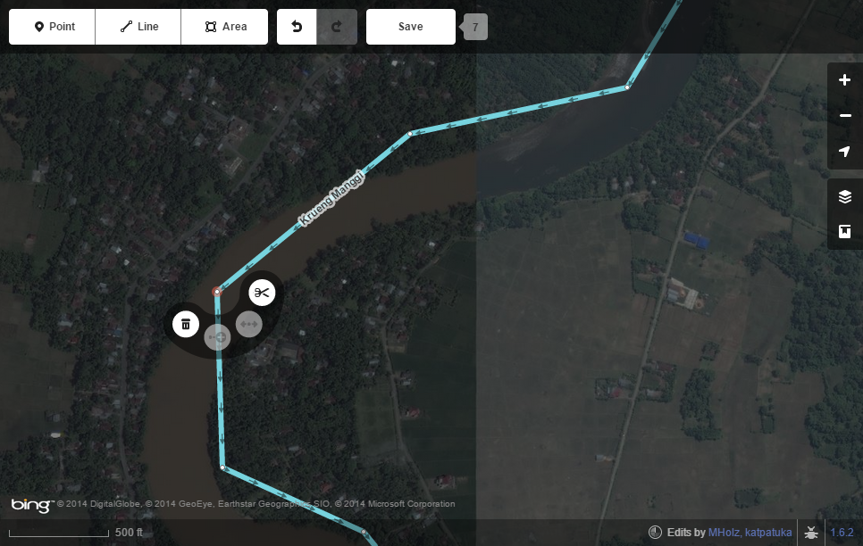
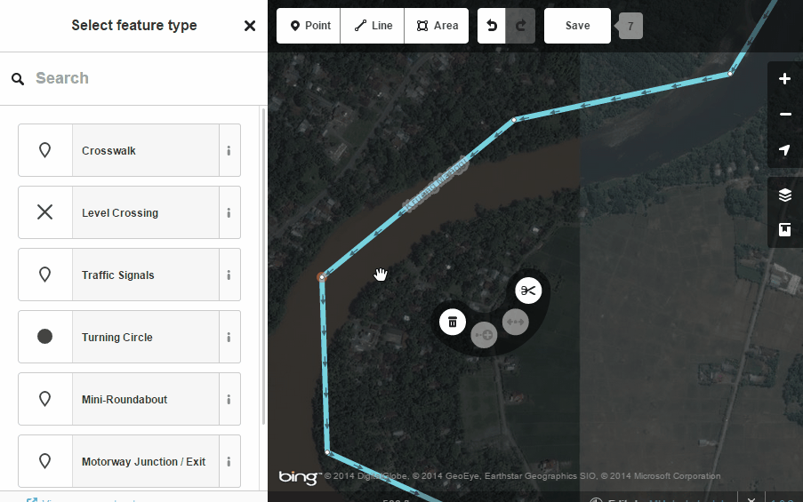
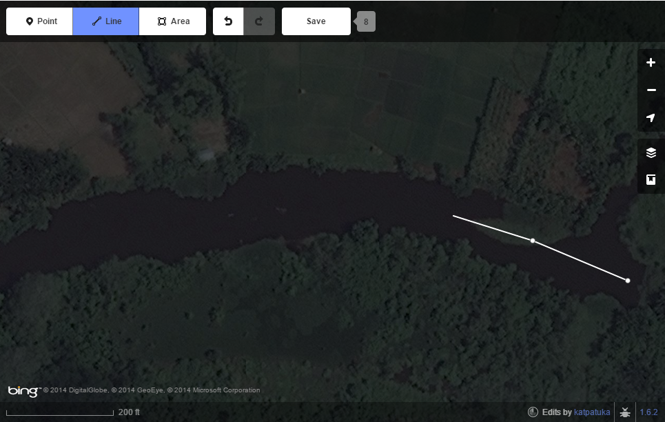
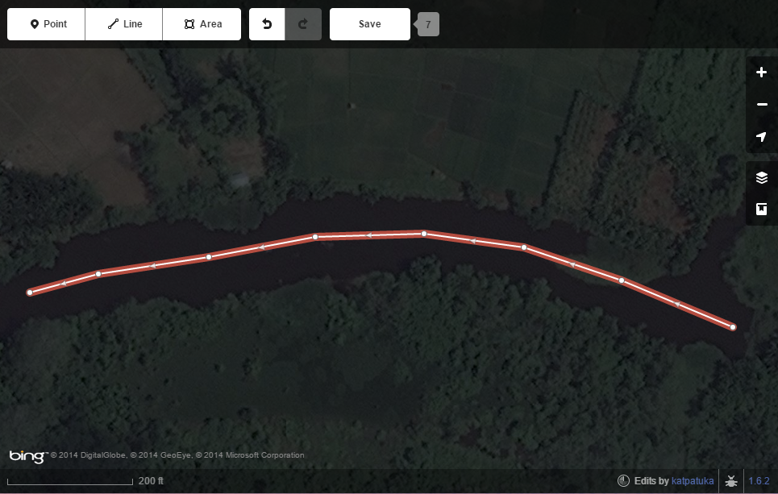
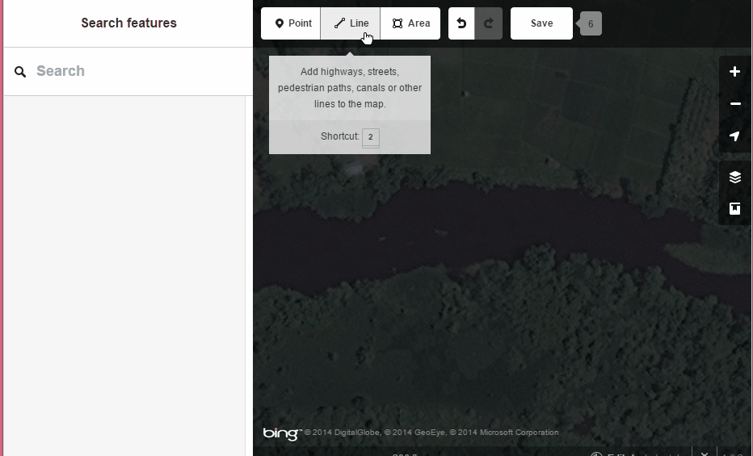

--
layout: archive
title: Tracing Water Features
--

###Rivers/Lakes

Many of the water features users encounter in Indonesia have already been added. However, there are still plenty smaller rivers, streams, and agricultural water features to map.

Editing Water Features:
While many water features are already in OSM, not all are traced correctly. Some were added via bulk upload using global datasets and as such, do not have good granularity.

<figure>
	
	<figcaption>Editing a line feature.</figcaption>
</figure>

<figure>
	
	<figcaption>Animation of editing a line feature.</figcaption>
</figure>

Creating Water Features:
When creating new water features in OSM, you first need to determine if a area or line is necessary. The choice is mostly in reference to rivers. You may trace the river as a polygon or use the line tool to trace the along the <i>center</i> of the river. With either option, the user must trace the whole length of the river. Because of this, both options will involve zooming and panning around the imagery.

How to Trace Rivers

<figure>
	
	<figcaption>Find a river that isn't in OSM and click on "Line".</figcaption>
</figure>

<figure>
	
	<figcaption>When done tracing, double click and tag appropriately.</figcaption>
</figure>

<figure>
	
	<figcaption>Short animation of river tracing.</figcaption>
</figure>

