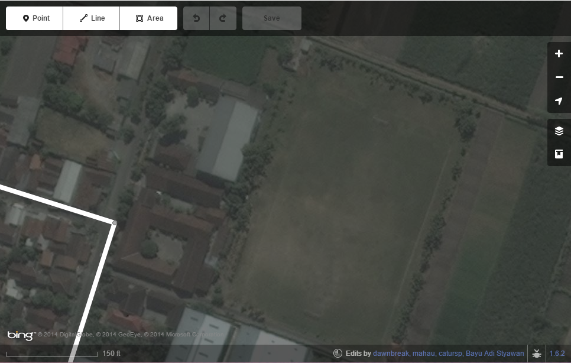
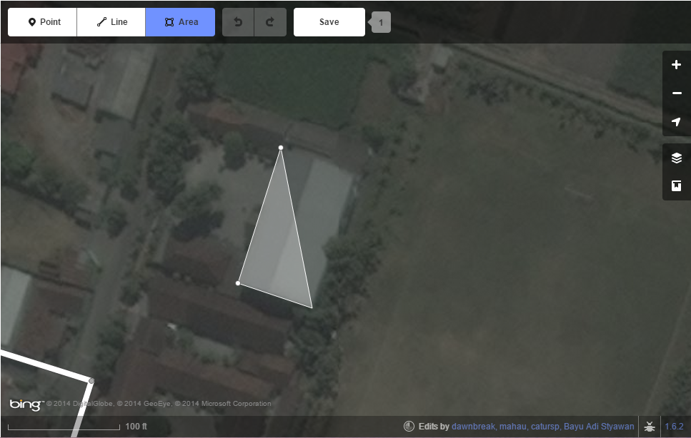
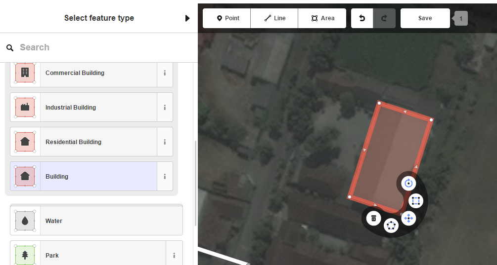
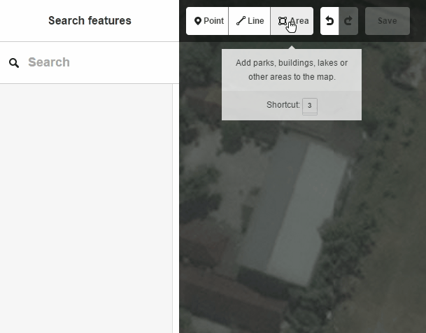

--
layout: archive
title: Tracing Buildings
--

##Buildings

Common building types in this region include, but are not limited to: homes, health clinics, schools, religious structures, shops, and agriculture.

How to Trace Buildings
To trace buildings, place a node around every corner. Some buildings will be harder to discern than others--in these cases, trace the buildings as best as possible. When tracing is complete, remember to tag the newly added feature. See the images below for a step-by-step explaination on how to trace a building.

<figure>
	
	<figcaption>Find a building that has not been mapped yet.</figcaption>
</figure>

<figure>
	
	<figcaption>Click on "Area" and begin tracing. Place a node at each corner of the building. A node is placed every time a user clicks on the mouse.</figcaption>
</figure>

<figure>
	
	<figcaption>After tracing is complete, double click to complete the polygon. Look at the tag list and click on "building".</figcaption>
</figure>

<figure>
	

	<figcaption>An animation of the process.</figcaption>
</figure>

