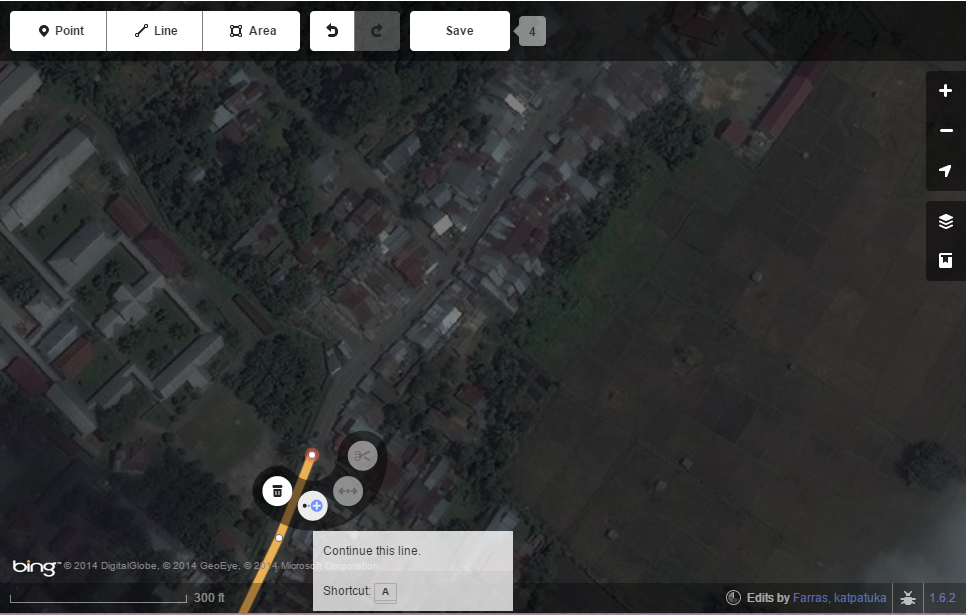
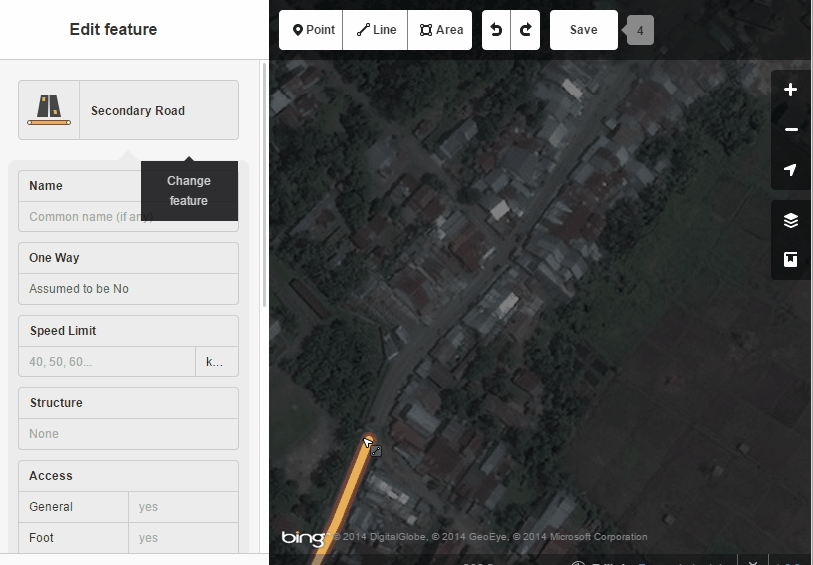
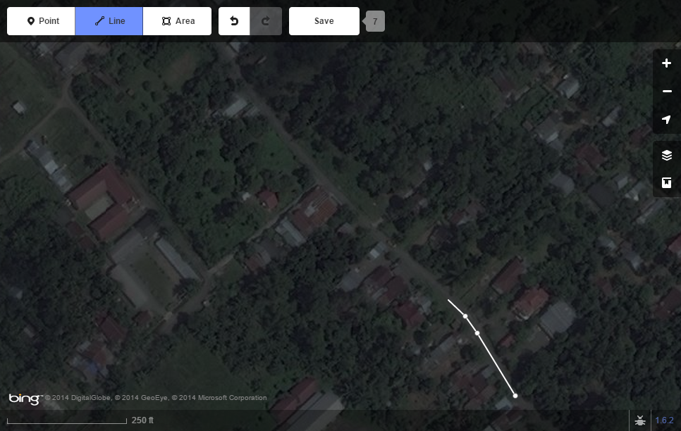
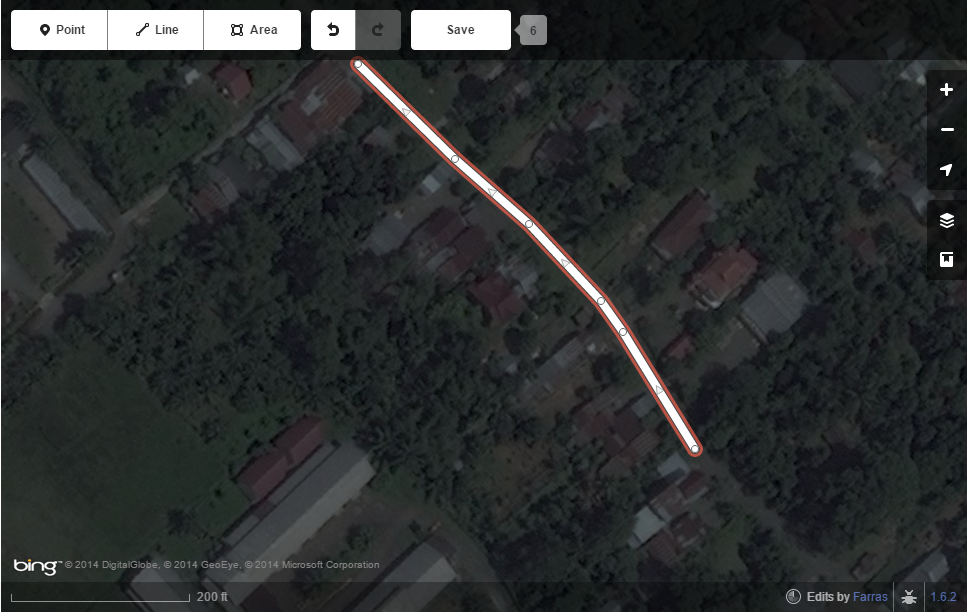
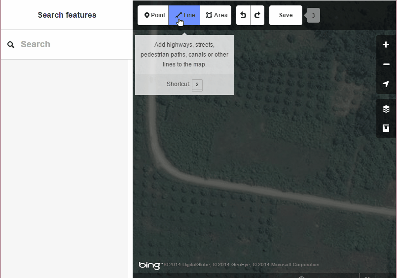

--
layout: post
title: Tracing Roads
--

###Roads

Editing Road Features:
Similar to the river features, not all road data is properly traced in OSM and can be edited. Roads may also not be completely, in which case a user can finish tracing the length of the road. 

<figure>
	
	<figcaption>Click on the last node of a line and select "Continue this line".</figcaption>
</figure>

<figure>
	
	<figcaption>Short animation on road editing.</figcaption>
</figure>

Creating Road Features:
There are plenty of roads that have not been traced into OpenStreetMap yet. If it is unclear what type of road it is, use the general "road" tag.

How to Trace Roads

<figure>
	
	<figcaption>Find a road that hasn't been traced in OSM. Click "Line" and begin tracing.</figcaption>
</figure>

<figure>
	
	<figcaption>Double-click when done and tag the new feature appropriately.</figcaption>
</figure>

<figure>
	
	<figcaption>Short animation on road creation.</figcaption>
</figure>
